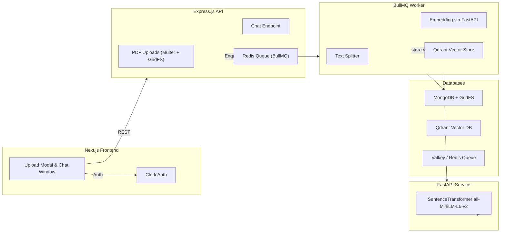

# 📄 DocChat — Chat with your PDFs

[](https://www.docker.com/)
[](https://nextjs.org/)
[](https://fastapi.tiangolo.com/)
[](https://www.langchain.com/)
[](https://qdrant.tech)
[](https://clerk.com)

Upload PDFs, index them into a vector database, and chat conversationally with AI — **all running locally in Docker.**

---

## ⚡ Quick Setup (One-liners)

You need **Docker** and **cURL/PowerShell**.

### 🐧 macOS / Linux
```bash
curl -fsSL https://docchat.adityamishra.tech | docker compose -p docchat -f - up -d
```

### 🪟 Windows (PowerShell)
```powershell
iwr https://docchat.adityamishra.tech -OutFile docker-compose.yml; docker compose -p docchat -f docker-compose.yml up -d
```

Once complete, your app will be available at:

```
http://localhost:49151
```

---

## 🏗️ Architecture



---

## ✨ Features

- 📤 **Upload PDFs** — Supports multiple files with drag & drop.  
- 🔍 **Semantic Search** — Indexes chunks into Qdrant for retrieval.  
- 💬 **Conversational AI** — Uses Gemini for responses with context injection.  
- 📚 **Document Library** — Sidebar with search, filters, and statuses.  
- 👤 **Authentication** — Secure access using Clerk.  
- ⚡ **Real-time Processing** — BullMQ worker updates doc statuses.  
- 🎨 **Modern UI** — Built with Next.js 15, Tailwind 4, Geist fonts, and Lucide icons.  

---

## 📂 Project Structure

```
docChat/
├── client/              # Next.js frontend (Clerk, Tailwind, components)
├── server/              # Node/Express API
│   ├── index.js         # Routes: /documents, /upload/pdf, /chat
│   ├── worker.js        # BullMQ worker for PDF → embeddings → Qdrant
│   ├── db.js            # Mongo + GridFS helpers
│   └── package.json
├── embed-server/        # FastAPI embedding microservice
│   ├── app.py           # /embeddings endpoint
│   └── requirements.txt
├── docker-compose.yml   # Orchestrates infra + services
└── README.md
```

---

## 🔐 Environment Variables

Create a `.env` file for the server:

```env
PORT=8000
MONGODB_URI=mongodb://mongo:27017
MONGODB_DB=docchat
REDIS_HOST=valkey
REDIS_PORT=6379
QDRANT_URL=http://qdrant:6333
EMBEDDINGS_URL=http://embedder:8001/embeddings
GEMINI_API_KEY=your_gemini_api_key_here
CLERK_SECRET_KEY=your_clerk_secret_key
```

Frontend requires:

```env
NEXT_PUBLIC_API_BASE=http://localhost:8000
NEXT_PUBLIC_CLERK_PUBLISHABLE_KEY=your_clerk_publishable_key
```

---

## 🖥️ Development

### Infra
```bash
# Start required infra (Valkey, Qdrant, Mongo)
docker compose up -d valkey qdrant mongo
```

### Client
```bash
cd client
pnpm i
pnpm dev
```

### Server
```bash
cd server
pnpm i
pnpm dev
```

### Worker
```bash
cd server
pnpm dev:worker
```

### Embedder
```bash
cd embed-server
pip install -r requirements.txt
uvicorn app:app --reload --port 8001
```

---

## 🧪 Testing

- Upload a PDF from the UI or drag & drop into the chat window.  
- Monitor logs with:
  ```bash
  docker compose logs -f
  ```
- Check health endpoints:
  - Server → `http://localhost:8000/`
  - Embedder → `http://localhost:8001/embeddings`

---

## 🛠️ Tech Stack

- **Frontend:** Next.js 15, Tailwind 4, Clerk, React 19  
- **Backend API:** Express, BullMQ, Clerk Auth  
- **Worker:** LangChain, Qdrant, MongoDB, pdf-parse, OCR fallback  
- **Embedder:** FastAPI + SentenceTransformers (`all-MiniLM-L6-v2`)  
- **Infra:** Docker Compose (Valkey/Redis, MongoDB, Qdrant)

---

## 🚀 Roadmap

- [x] OCR fallback for scanned PDFs (Tesseract).  
- [ ] Multi-turn memory (session-based).  
- [ ] Export chat as Markdown/PDF.  
- [ ] Collaboration: share docs with team.